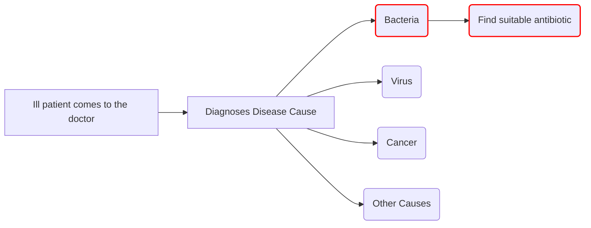
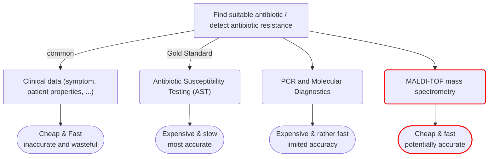
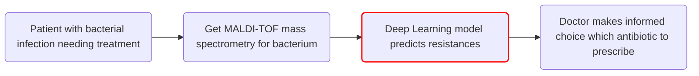

[Link zur Implementierung](https://github.com/lartmann/DL-Antimicrobial-Resistance-Prediction)

This project contains an implementation of a deep learning multi-label classifier that predicts the antibiotic resistance based on the (MALDI-TOF) mass spectrometry of a bacterium by using different architectures in combination with a masked loss. The data inspection, training and evaluation are contained in the `results.ipynb` notebook. The hyperparameters are specified in the `config.py`.

---

# Why This Matters



Finding a suitable antibiotic is a crucial step in the treatment of patients. Which can be a matter of life and death depending on the condition of the patient and the severity of the disease. Furthermore, prescribing antibiotics that don't work can contribute to over-prescription which is one of the major contributors of antibiotic resistant bacteria which are one of the grand challenges of modern medicine.<sup>1</sup>

---

# Main Methods



<br>

Detecting antibiotic resistance with Matrix-Assisted Laser Desorption/Ionization Time-of-Flight (MALDI-TOF) mass spectrometry is a more recent approach that offers a lot of benefits. <br>
It's faster and cheaper than AST or PCR, yet more accurate than clinical observation. This makes it ideal for large-scale use, providing results in ~5 minutes for ~$0.50<sup>2</sup>.
Therefore, it has the potential to significantly improve day to day antibiotic prescribtion and slowing down the development of resistances.

---

# Proposed AI Pipeline for Resistance Prediction

<br>


Current research leaves a gap at general deep learning models for this task. Most research focuses on a small subset of bacteria species and antibiotics which leaves the field with many small models while practical implementation would require models that can handle a broad range of bacteria and antibiotics.<sup>3</sup>

This project aims to contribute to the advancement of research by proposing a pipeline for training and inference of a general antibiotic resistance prediction model and hereby filling this gap in research.

<br>

## Dataset - DIRAMS<sup>4</sup>

- Database with mass spectra profiles with linked antimicrobial susceptibility phenotypes
- Mass spectra are binned and common preprocessing steps are applied
- More than 120,000 preprocessed samples from different institutions in switzerland


---

# References

1. C. Llor and L. Bjerrum, “Antimicrobial resistance: risk associated with antibiotic overuse and initiatives to reduce the problem,” Therapeutic Advances in Drug Safety, vol. 5, no. 6, pp. 229–241, Dec. 2014, doi: 10.1177/2042098614554919.

2. N. Dhiman, L. Hall, S. L. Wohlfiel, S. P. Buckwalter, and N. L. Wengenack, “Performance and Cost Analysis of Matrix-Assisted Laser Desorption Ionization–Time of Flight Mass Spectrometry for Routine Identification of Yeast,” J Clin Microbiol, vol. 49, no. 4, pp. 1614–1616, Apr. 2011, doi: 10.1128/JCM.02381-10.
3. L. S. Santiago, A. Guerrero-López, C. Sevilla-Salcedo, D. Rodríguez-Temporal, B. Rodríguez-Sánchez, and V. Gómez-Verdejo, “Machine Learning applied to MALDI-TOF data in a clinical setting: a systematic review,” Jan. 28, 2025. doi: 10.1101/2025.01.25.634879.
4. C. Weis, A. Cuénod, B. Rieck, K. Borgwardt, and A. Egli, “DRIAMS: Database of Resistance Information on Antimicrobials and MALDI-TOF Mass Spectra.” Dryad, p. 144838557987 bytes, Nov. 01, 2021. doi: 10.5061/DRYAD.BZKH1899Q.

---

# The project
> Note: Below is only part of the implementation. The whole code with all classes and functions can be found in [this repository](https://github.com/lartmann/DL-Antimicrobial-Resistance-Prediction).

{::nomarkdown}
<div style="background-color: white; color: black; padding: 1em; border-radius: 8px;">






<p>Sorry, the notebook you are looking for does not exist.</p>

</div>
{:/nomarkdown}
```
